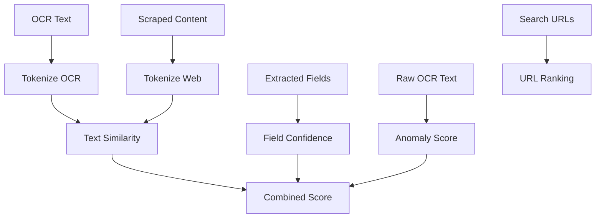

# Algorithm Overview

This project uses three simple, rule-based algorithms in the verification pipeline,
combined into a single score:

## 1) Text Similarity

**Location:** [utils.py](utils.py)

**Function:** `text_similarity_score(...)`

**Purpose:** Compares OCR text to scraped web content using token overlap.

**Formula:**

Let $T_{ocr}$ be OCR tokens and $T_{web}$ be web tokens.

Jaccard similarity:

$$J = \frac{|T_{ocr} \cap T_{web}|}{|T_{ocr} \cup T_{web}|}$$

Score:

$$\text{SimilarityScore} = \min(100, \lfloor 200 \cdot J \rfloor)$$

## 2) Field Confidence

**Location:** [utils.py](utils.py)

**Function:** `field_confidence_score(...)`

**Purpose:** Scores presence of key fields (competition, organizer, date) and
their appearance in URLs or scraped content.

**Formula (point-based):**

- Base points: competition +35, organizer +35, date +20
- Evidence points: +5 each if competition/organizer/date appears in scraped content
- URL points: +5 each if competition/organizer appears in URLs

Score is capped at 100.

## 3) Anomaly Score

**Location:** [utils.py](utils.py)

**Function:** `anomaly_score(...)`

**Purpose:** Penalizes suspicious OCR text patterns (too short, too many digits,
or suspicious keywords).

**Formula (penalty-based):**

Start at 100, then subtract penalties:

- Length < 50: -50
- Length < 100: -30
- Suspicious keywords present: -40
- Digits ratio > 0.25: -20
- Letters ratio < 0.30: -20

Final score is clamped to $[0, 100]$.

## Combined Score

**Location:** [utils.py](utils.py)

**Function:** `calculate_combined_score(...)`

**Weights:**

- Text similarity 40%
- Field confidence 40%
- Anomaly score 20%

**Formula:**

$$\text{Combined} = \lfloor 0.4S + 0.4F + 0.2A \rfloor$$

Where $S$ = similarity score, $F$ = field confidence, $A$ = anomaly score.

**Where used:** [app.py](app.py) in Step 4 (Calculating accuracy score).

## 4) URL Relevance Ranking

**Location:** [utils.py](utils.py)

**Function:** `rank_search_urls(...)`

**Purpose:** Orders search results so the most relevant URLs are scraped first.

**Ranking rule:**

Each URL gets points for:

- Official domain: +3
- Social media domain: +2
- Event year in URL: +2
- Each token match from organizer/competition: +1

URLs are sorted by descending total.

## Flowchart

**Signals used:**

- Official domains (.gov, .edu, .org)
- Social media domains
- Organizer/competition tokens in the URL
- Event year in the URL

**Where used:** [app.py](app.py) before scraping in Step 3 (Searching online for verification).
